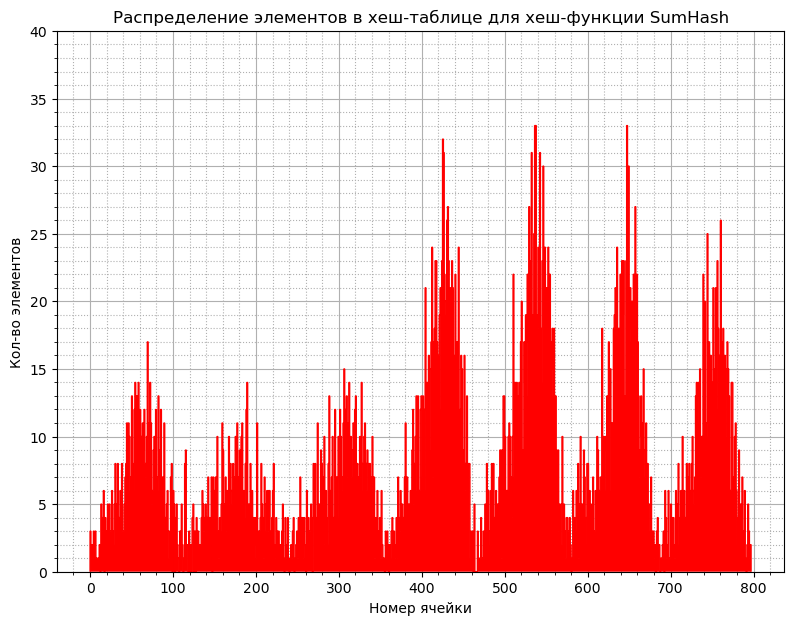

# Hash-table-optimization
Здраствуйте!

На этот раз задача была следующая:
1) Реализовать структуру данных хеш-таблица на языке программирования Си.
2) Построить гистограммы заселенности для нескольких хеш-функций.
3) Для каждой хеш-функции высчитать дисперсию распределения элементов по ячейкам.
4) Оптимизировать алгоритмы хеш-таблицы всячески используя язык Ассемблер.

## Установка

## Что такое хеш-таблица?


Хеш-таблица - структура данных, которая базируется на соответствии ключа(какие-то данные) и его хеш-значения(какое-то число, зависящее от ключа).
Ключ с его хеш-значением обычно называют парой.

Хеш-таблица позволяет выполнять над собой три операции:
1) Поиск пары по ключу.
2) Добавление пары.
3) Удаление пары.


Большой __плюс__ хеш-таблицы - скорость по сравнению с другими.
В лучшем случае, доступ к данным можно совершить за O(1).
В худшем (при возникновении __коллизий__) - за O(n).


Большой __минус__ хеш-таблицы - использование большого кол-ва памяти в сравнении с другими структурами данных.

### Коллизии
Ситуацию, при которой разным ключам соответствует одно и то же хеш-значение называется __коллизией__.

Существует несколько методов разрешения проблемы коллизий. О них вы можете узнать [здесь](https://ru.wikipedia.org/wiki/%D0%A5%D0%B5%D1%88-%D1%82%D0%B0%D0%B1%D0%BB%D0%B8%D1%86%D0%B0)

В своей реализации я использовал метод списков - каждое множество представляет собой список, содержащий ключи
с одинаковыми хеш-значениями

### Load Factor

## Анализ хеш-функций
Для тестирования хеш-функций сначала в хеш-таблицу загружался текст произведения Шекспира "Гамлет" поделенный на слова.

__[to be redacted]__
    Идеальной хеш-функцией считается та, которая может обеспечить равномерное распределение элементов
    хеш-таблицы по ее подмножествам/спискам.

Соответственно, мы можем определить насколько хорош алгоритм хеширования используя
такую вещь, как __дисперсия__.

__Дисперсия__ характеризует, насколько кольчество элементов в подможествах отличается от среднего кол-ва
элементов в подмножестве.

Считается дисперсия по следующей формуле:


Соответственно, чем меньше дисперсия - тем лучше алгоритм.

Так же удобно строить __гистограммы заселенности__ хеш-таблицы.
Они позволяют наглядно увидеть, само распределение элементов по подножествам.

Далее будут приведены дисперсии и гистограммы заселенности для нескольких
реализованных мной хеш-алгоритмов.

1) хеш-функция, возвращающая ноль (далее ZeroHash):
```cpp
static uint64_t ZeroHash(char *data)
{
    return 0;
}

```

Гистограмма заселенности:


Дисперсия: 40152.63

2) хеш-функция, возвращающая ASCII код первого символа в слове (далее StupidHash):
```cpp
static uint64_t StupidHash(char *data)
{
    return *data;
}

```


Гистограмма заселенности:


Дисперсия: 1741.259

3) хеш-функция, возвращающая длину слова (далее StrlenHash):
```cpp
static uint64_t StrlenHash(char *data)
{
    return strlen(data);
}

```


Гистограмма заселенности:


Дисперсия: 5558.15

4) хеш-функция, возвращающая сумму ASCII кодов всех символов в слове (далее SumHash):
```cpp
static uint64_t SumHash(char *data)
{
    uint64_t sum = 0;

    for (size_t i = 0; data[i] != '\0'; i++)
    {
        sum += data[i];
    }

    return sum;
}
```


Гистограмма заселенности:


Дисперсия: 42.29

5) хеш-функция, возвращающая частное от суммы ASCII кодов всех символов в слове и его длинны (далее SumStrlenHash):
```cpp
static uint64_t SumStrlenHash(char *data)
{
    uint64_t sum = SumHash(data);

    uint64_t word_len = strlen(data);

    if (word_len == 0)
    {
        return 0;
    }

    return (uint64_t) (sum / word_len);
}
```


Гистограмма заселенности:


Дисперсия: 2925.81

6) хеш-функция, реализиющая следующий алгоритм(КАВО!!!)(далее RorHash):
```cpp
static uint64_t RorHash(char *data)
{
    uint64_t hash_val = 0;

    for (size_t i = 0; data[i] != '\0'; i++)
    {
        hash_val = (hash_val | (hash_val & (~((~0) << 1)))) ^ data[i];
    }

    return hash_val;
}
```

Гистограмма заселенности:


Дисперсия: 27.98

7) RolHash:
```cpp
static uint64_t LorHash(char *data)
{
    uint64_t hash_val = 0;

    for (size_t i = 0; data[i] != '\0'; i++)
    {

        hash_val = ((hash_val << 1) | ((hash_val & (~((~0) >> 1))) >> 63)) ^ data[i];

    }

    return hash_val;
}
```

Гистограмма заселенности:


Дисперсия: 13.27

8) CRC32Hash:
```cpp
uint64_t CRC32Hash(char *data)
{
    uint32_t mask = 0;

    uint32_t hash_val = 0xFFFFFFFF;

    for (size_t i = 0; data[i] != 0; i++)
    {
        hash_val = hash_val ^ ((uint32_t) data[i]);

        for (size_t j = 0; j < 8; j++)
        {
            mask = -(hash_val & 1);

            hash_val = (hash_val >> 1) ^ (0xEDB88320 & mask);
        }
    }

    return (uint64_t) ~hash_val;
}
```

Гистограмма заселенности:


Дисперсия: 9.58

Можем видеть, что минимальная диспресия принадлежит функции CRC32Hash().
Поэтому в дальнейших тестах будем использовать её.

## Поиск узких мест
Для поиска узких мест в алгоритмах хеш-таблицы я использовал утилиту perf.

Для тестов был взят текст произведения Шекспира "Король Лир", поделенный на слова.

Тест представляет из себя поиск всех слов из "Короля Лир" 2560 раз.

Для начала проведем профилирование для базовой версии (без оптимизации):

```
Call graph:

# Children      Self  Command    Shared Object     Symbol
# ........  ........  .........  ................  .......................................................
#
    99.96%     0.00%  HashTable  libc.so.6         [.] __libc_start_call_main
            |
            ---__libc_start_call_main
               main
               |
                --99.72%--TestHashTable(HashTable*, WordSet*)
                          |
                           --98.45%--HashTableFindElem(HashTable*, char*, HashTablePos*)
                                     |
                                     |--74.00%--CRC32Hash(char*)
                                     |
                                     |--11.04%--ListFind(List*, char*, unsigned long*)
                                     |
                                     |--7.05%--__strcmp_evex
                                     |
                                      --0.56%--strcmp@plt


Stat:
          9 399,92 msec task-clock                       #    1,000 CPUs utilized               ( +-  0,16% )
                32      context-switches                 #    3,404 /sec                        ( +-  9,35% )
                 2      cpu-migrations                   #    0,213 /sec                        ( +- 21,24% )
               840      page-faults                      #   89,362 /sec                        ( +-  0,02% )
    42 048 202 548      cycles                           #    4,473 GHz                         ( +-  0,03% )
    60 452 494 102      instructions                     #    1,44  insn per cycle              ( +-  0,00% )
     6 325 683 532      branches                         #  672,951 M/sec                       ( +-  0,00% )
           209 171      branch-misses                    #    0,00% of all branches             ( +- 11,62% )
                        TopdownL1                 #     65,8 %  tma_backend_bound
                                                  #      3,5 %  tma_bad_speculation
                                                  #      0,4 %  tma_frontend_bound
                                                  #     30,2 %  tma_retiring             ( +-  0,07% )

            9,4005 +- 0,0148 seconds time elapsed  ( +-  0,16% )
```


Как можем заметить, узкими местами в алгоритмах хеш-таблицы являются следующие функции:
1) CRC32Hash()
2) ListFind() (вызывается следующей функцией)
3) HashTableFindElem()

>__strcmp_evex() я здесь не учел, так как эту функцию писали мужики, знающие свое дело.
>Вряд ли я смогу его ускорить, но есть одна хитрость, которая мне в этом поможет.
>Позже я вам о ней поведаю.

Что ж, давайте оптимизировать!

## Оптимизация

Перед тем, как приступить к оптимизации, хотелось бы подчеркнуть тот факт, что ускорение, полученное мной, может розниться
от системы к системе. Ускорение может зависеть от различного множества всяческих факторов: от версии компилятора до
комплектующих вашего ПК.
Ниже преведены параметры моей системы:

|                               |                        |
|:-----------------------------:|:----------------------:|
|Процессор                      | Intel core i5 11400H.  |
|Кол-во оперативной памяти      | 16гб.                  |
|ОС                             | Ubuntu Linux 22.04.4.  |
|Версия ядра Ubuntu             | 6.5.0-26-generic.      |
|Используемый компилятор        | g++                    |
|Версия компилятора             | 11.4.0                 |


### Оптимизация №1: Hash
Давайте попытаемся оптимизировать самую тяжелую функцию - функцию хеширования.

Так совпало (зуб даю, реально совпало), что существует:
1) инструкция процессора __crc32__
2) intrinsic функция ___mm_crc32_u8()__

 А методов реализовывать оптимизацию существует аж целых 3:
1) функция языка Си под названием asm()
2) функция написанная на языке Ассемблер, вызываемая в Си
3) intrinsic функции

Для примера я написал функцию на Ассемблере, которая считает хеш CRC32:
```nasm
asm_CRC32Hash:
; Entering function
    push rbp
    mov rbp, rsp

    xor rax, rax
; Hash start value
    mov eax, 0xffffffff

    jmp .HashTest
.HashCycle:
    crc32 eax, byte [rdi]

    inc rdi
.HashTest:
    cmp byte [rdi], 0
    ja .HashCycle

; Leaving function
    mov rsp, rbp
    pop rbp

    ret
```

Результаты профилирования для версии с asm_CRC32Hash():
```
Call graph:

# Children      Self  Command    Shared Object         Symbol
# ........  ........  .........  ....................  .......................................................
#
    99.76%     0.00%  HashTable  libc.so.6             [.] __libc_start_call_main
            |
            ---__libc_start_call_main
               main
               |
               |--98.55%--TestHashTable(HashTable*, WordSet*)
               |          |
               |          |--92.15%--HashTableFindElem(HashTable*, char*, HashTablePos*)
               |          |          |
               |          |          |--41.86%--ListFind(List*, char*, unsigned long*)
               |          |          |
               |          |          |--26.69%--__strcmp_evex
               |          |          |
               |          |          |--3.77%--asm_CRC32Hash.HashCycle
               |          |          |
               |          |          |--3.17%--strcmp@plt
               |          |          |
               |          |          |--2.07%--asm_CRC32Hash.HashTest
               |          |          |
               |          |           --1.06%--asm_CRC32Hash
               |          |
               |          |--0.91%--ListFind(List*, char*, unsigned long*)
               |          |
               |           --0.84%--asm_CRC32Hash
               |
                --1.07%--HashTableFindElem(HashTable*, char*, HashTablePos*)

Stat:
          1 757,61 msec task-clock                       #    1,000 CPUs utilized               ( +-  0,65% )
                 7      context-switches                 #    3,983 /sec                        ( +-  9,17% )
                 0      cpu-migrations                   #    0,000 /sec
               841      page-faults                      #  478,490 /sec                        ( +-  0,02% )
     7 627 247 609      cycles                           #    4,340 GHz                         ( +-  0,28% )
    22 847 753 012      instructions                     #    3,00  insn per cycle              ( +-  0,00% )
     3 441 280 626      branches                         #    1,958 G/sec                       ( +-  0,00% )
           594 347      branch-misses                    #    0,02% of all branches             ( +- 68,39% )
                        TopdownL1                 #     33,1 %  tma_backend_bound
                                                  #      3,6 %  tma_bad_speculation
                                                  #      3,8 %  tma_frontend_bound
                                                  #     59,5 %  tma_retiring             ( +-  0,29% )

            1,7580 +- 0,0115 seconds time elapsed  ( +-  0,65% )

```


