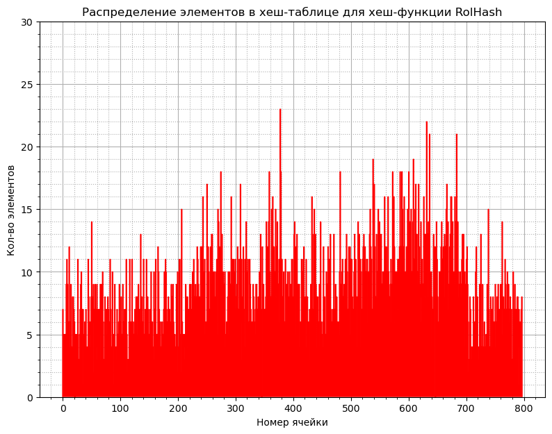
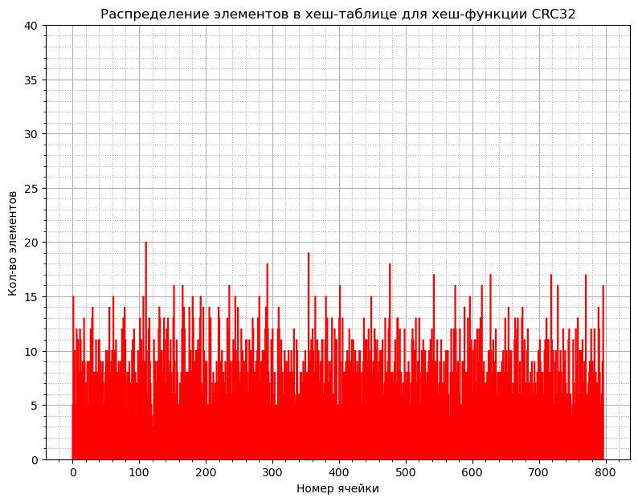

# Hash-table-optimization
Здраствуйте!

На этот раз задача была следующая:
1) Реализовать структуру данных хэш-таблица на языке программирования Си.
2) Построить гистограммы заселенности для нескольких хэш-функций.
3) Для каждой хэш-функции высчитать дисперсию распределения элементов по ячейкам.

## Установка

## Что такое хэш-таблица?

## Анализ хэш-функций


Идеальной хэш-функцией считается та, которая может обеспечить равномерное распределение элементов
хэш-таблицы по ее подмножествам/спискам.

Соответственно, мы можем определить насколько хорош алгоритм хэширования используя
такую вещь, как __дисперсия__.

__Дисперсия__ характеризует, насколько кольчество элементов в подможествах отличается от среднего кол-ва
элементов в подмножестве.

Считается дисперсия по следующей формуле:


Соответственно, чем меньше дисперсия - тем лучше алгоритм.

Так же удобно строить __гистограммы заселенности__ хэш-таблицы.
Они позволяют наглядно увидеть, само распределение элементов по подножествам.

Далее будут приведены дисперсии и гистограммы заселенности для нескольких
реализованных мной хэш-алгоритмов.

1) Хэш-функция, возвращающая ноль (далее ZeroHash):
```cpp
static uint64_t ZeroHash(char *data)
{
    return 0;
}

```

Гистограмма заселенности:


Дисперсия: 40152.63

2) Хэш-функция, возвращающая ASCII код первого символа в слове (далее StupidHash):
```cpp
static uint64_t StupidHash(char *data)
{
    return *data;
}

```


Гистограмма заселенности:


Дисперсия: 1741.259

3) Хэш-функция, возвращающая длину слова (далее StrlenHash):
```cpp
static uint64_t StrlenHash(char *data)
{
    return strlen(data);
}

```


Гистограмма заселенности:


Дисперсия: 5558.15

4) Хэш-функция, возвращающая сумму ASCII кодов всех символов в слове (далее SumHash):
```cpp
static uint64_t SumHash(char *data)
{
    uint64_t sum = 0;

    for (size_t i = 0; data[i] != '\0'; i++)
    {
        sum += data[i];
    }

    return sum;
}
```


Гистограмма заселенности:


Дисперсия: 42.29

5) Хэш-функция, возвращающая частное от суммы ASCII кодов всех символов в слове и его длинны (далее SumStrlenHash):
```cpp
static uint64_t SumStrlenHash(char *data)
{
    uint64_t sum = SumHash(data);

    uint64_t word_len = strlen(data);

    if (word_len == 0)
    {
        return 0;
    }

    return (uint64_t) (sum / word_len);
}
```


Гистограмма заселенности:


Дисперсия: 2925.81

6) Хэш-функция, реализиющая следующий алгоритм(КАВО!!!)(далее RorHash):
```cpp
static uint64_t RorHash(char *data)
{
    uint64_t hash_val = 0;

    for (size_t i = 0; data[i] != '\0'; i++)
    {
        hash_val = (hash_val | (hash_val & (~((~0) << 1)))) ^ data[i];
    }

    return hash_val;
}
```

Гистограмма заселенности:


Дисперсия: 27.98

7) RolHash:
```cpp
static uint64_t LorHash(char *data)
{
    uint64_t hash_val = 0;

    for (size_t i = 0; data[i] != '\0'; i++)
    {

        hash_val = ((hash_val << 1) | ((hash_val & (~((~0) >> 1))) >> 63)) ^ data[i];

    }

    return hash_val;
}
```

Гистограмма заселенности:


Дисперсия: 13.27

8) CRC32Hash:
```cpp
uint64_t CRC32Hash(char *data)
{
    uint32_t mask = 0;

    uint32_t hash_val = 0xFFFFFFFF;

    for (size_t i = 0; data[i] != 0; i++)
    {
        hash_val = hash_val ^ ((uint32_t) data[i]);

        for (size_t j = 0; j < 8; j++)
        {
            mask = -(hash_val & 1);

            hash_val = (hash_val >> 1) ^ (0xEDB88320 & mask);
        }
    }

    return (uint64_t) ~hash_val;
}
```

Гистограмма заселенности:


Дисперсия: 9.58

Анализ показывает, что лучше всех в плане равномерного распределения слов по ячейкам ведет себя CRC32.
Далее будем использовать именно его.

## Поиск узких мест
Для поиска узких мест в алгоритмах хэш-таблицы я использовал утилиту perf.

Для тестов был взят текст произведения Гамлета "Король Лир".

Чтобы узнать исходные показатели (производительности)? будем компилировать программу
без всяких флагов оптимизации.

Результаты профилирования №1:


Как можем заметить, узкими местами в алгоритмах хэш-таблицы являются следующие функции:
1) CRC32Hash()
2) ListFind() (вызывается следующей функцией)
3) HashTableFindElem()

С помощью perf stat узнаем среднее время выполнения программы.
<картинка бляу>

>__strcmp_evex() я здесь не учел, так как эту функцию писали мужики, знающие свое дело.
>Вряд ли я смогу его ускорить, но есть одна хитрость, которая мне в этом поможет.
>Позже я вам о ней поведаю.

Что ж, давайте оптимизировать!

## Оптимизация №1: Hash
Давайте попытаемся оптимизировать самую тяжелую функцию - функцию хэширования.

Так совпало (зуб даю, реально совпало), что существует:
1) инструкция процессора __crc32__
2) intrinsic функция ___mm_crc32_u8()__

А методов реализовывать оптимизацию существует аж целых 3:
1) функция языка Си под названием asm()
2) функция написанная на языке Ассемблер, вызываемая в Си
3) intrinsic функции

Для примера я написал функцию на Ассемблере, которая считает хэш CRC32:
```nasm
asm_CRC32Hash:
; Entering function
    push rbp
    mov rbp, rsp

    xor rax, rax
; Hash start value
    mov eax, 0xffffffff

    jmp .HashTest
.HashCycle:
    crc32 eax, byte [rdi]

    inc rdi
.HashTest:
    cmp byte [rdi], 0
    ja .HashCycle

; Leaving function
    mov rsp, rbp
    pop rbp

    ret
```


